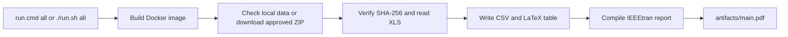

# Warehouse project template

This is a small working example for the Warehousing course. One command checks
the approved S. P. Richards data, creates a zone summary, writes a LaTeX table,
and builds an IEEE-style PDF. Keep the command and replace the example analysis
with your group's work.

## Run it

Install and start [Docker Desktop](https://www.docker.com/products/docker-desktop/)
(Windows or macOS), or [Docker Engine](https://docs.docker.com/engine/install/)
(Linux). The Dockerfile installs Python 3.12, `xlrd`, `latexmk`, and the LaTeX
packages required by `IEEEtran`. You do not need to install Python or LaTeX on
your computer.

From this folder, run:

```bat
run.cmd all
```

On macOS or Linux, run `./run.sh all` instead. The first run builds the Docker
image and may take several minutes. The command downloads the data if needed,
then creates `artifacts/zone_summary.csv`, `artifacts/zone_table.tex`, and
`artifacts/main.pdf`. Open the PDF to see the generated table. Later runs reuse
checked files in `data/raw/`.

If you already have `DC23ACTIVE.zip` or `DC23ACTIVE AS OF 050210.xls`, place it
in `data/raw/` before running the command. The pipeline checks its SHA-256 hash
against `data/sources.json` and skips the download. A mismatched file stops the
run with an error. Leave the original filenames unchanged.

## How it works



The Python entry point is `pipeline.py`. The example reads the `DC23ACTIVE`
sheet and counts active locations and distinct SKUs by zone. It skips the
file's trailing Ctrl-Z end marker and sums units on hand. `report/main.tex`
imports the generated table and summary text, so the
PDF depends on the pipeline output. The table and PDF are regenerated by `all`.

For an extra example, run `run.cmd scenario --factor 1.10` (or the matching
`run.sh` command). This writes `artifacts/scenario_inventory_factor.csv`. The
factor is only a demonstration of the command structure. It is not a demand
forecast or a storage recommendation. Add your own analyses to `pipeline.py` or
call other modules from it, and include every result used in your final report
in the `all` command.

## Project files

| Path | Purpose |
|---|---|
| `data/sources.json` | Approved URL, original filenames, and SHA-256 hashes |
| `data/raw/` | Original course files, excluded from Git |
| `pipeline.py` | Data check, analysis, scenario, and PDF build |
| `report/main.tex` | IEEEtran report source |
| `report/references.bib` | Report references |
| `Dockerfile` and `requirements.txt` | Python and LaTeX setup |
| `artifacts/` | Generated CSV, LaTeX inputs, run record, and PDF; excluded from Git |

The `.cmd` and `.sh` files call the same Python entry point. If you prefer a
different language or project structure, keep the single documented command,
the `data/raw/` directory, and a clean run that rebuilds your report.

## Data and references

The source is the [S. P. Richards Philadelphia DC
project](https://www.warehouse-science.com/wh/projects/spr3/main.html). Its
company data are copyrighted and proprietary, and the source page limits their
use to course purposes. **Do not commit raw data or source records to GitHub.**
The `.gitignore` file keeps `data/raw/` out of the repository while retaining
the empty folder.

The project structure draws on [The Turing Way's research
compendia](https://book.the-turing-way.org/reproducible-research/compendia/)
and [data management
checklist](https://book.the-turing-way.org/reproducible-research/rdm/rdm-checklist/).
[Cookiecutter Data Science](https://drivendata.github.io/cookiecutter-data-science/)
has another useful directory layout. The report uses the
[IEEE conference LaTeX format](https://conferences.ieeeauthorcenter.ieee.org/write-your-paper/authoring-tools-and-templates/)
through `IEEEtran`.

## Check your submission

Before submitting, clone your chosen commit into a new directory and run the
same command you put in the README. Check that the data are verified, the PDF
builds, and its numbers match the CSV. Run it a second time to check that it
reuses the raw files. Submit the exact Git commit or a ZIP and the final PDF
through Canvas, following the [course file
requirements](https://brenobeirigo.github.io/course-wh/assessment/reproducible-project-package.html).
