# Warehouse project template

This is a working starting point for the University of Twente Warehousing
project. One command obtains the approved S. P. Richards source files, checks
them, generates a zone summary, chart, and LaTeX table, and builds an IEEE-style PDF.
The report is a scaffold for one management argument across the five assessed
parts. Replace its student prompts and example analysis with your group's work.

## Run the example

Install and start [Docker Desktop](https://www.docker.com/products/docker-desktop/)
on Windows or macOS, or [Docker Engine](https://docs.docker.com/engine/install/)
on Linux. The Dockerfile fixes Python 3.12 and installs the Python and LaTeX
requirements, including `latexmk` and the `IEEEtran` class. No separate Python
or LaTeX installation is required.

From the project directory, run:

```bat
run.cmd all
```

On macOS or Linux, use `./run.sh all`. The first run builds the Docker image
and downloads missing source files, so allow several minutes and enough disk
space for the archives and extracted files. Later runs reuse verified files in
`data/raw/`. The command writes `artifacts/zone_summary.csv`,
`artifacts/zone_table.tex`, `artifacts/zone_locations.png`, and
`artifacts/main.pdf`. Open the PDF to see the table and chart built from the
data.

If approved original files are already on your computer, place them in
`data/raw/` with their original filenames. The pipeline checks their SHA-256
hashes against [the source manifest](data/sources.json) and downloads only
missing files. A mismatch stops the run with a clear error. Do not edit the
original files.

## The pipeline

```mermaid
flowchart LR
    A[run.cmd all or ./run.sh all] --> B[Build Docker image]
    B --> C[Check data/raw against source manifest]
    C --> D[Download missing originals]
    D --> E[Verify hashes and extract archives]
    E --> F[Run baseline and example scenario]
    F --> G[Write CSV, chart, and LaTeX table]
    G --> H[Compile IEEEtran report]
    H --> I[artifacts/main.pdf]
```



`pipeline.py` is the common entry point. The example reads the
`DC23ACTIVE` sheet, counts active locations and distinct SKUs by zone, and
sums units on hand. It skips the historical file's trailing Ctrl-Z marker.
`report/main.tex` imports the generated table, chart, and summary text. The
PDF therefore depends on the pipeline output. The `all` command regenerates
these files each time.

Run `run.cmd scenario --factor 1.10` on Windows, or `./run.sh scenario
--factor 1.10` on macOS or Linux, for a small command example. It writes
`artifacts/scenario_inventory_factor.csv`. The factor is a demonstration of
the interface. It is not a demand forecast or a storage recommendation.
Add your own analyses to `pipeline.py` or call modules from it. Include every
analysis and simulation used in your report in the `all` command, with fixed
scenario settings and random seeds where needed.

## Report structure and writing help

[The report source](report/main.tex) uses the IEEE conference class. Its
suggested subsections cover the decision, diagnosis, storage, layout, picking,
matched trade-offs, and implementation. An opening section explains how the
five parts are graded. The section headings can be reorganized to support one
management argument within the course's **12-page limit**. The grading notes
and italic prompts are teaching material. Remove them before submission.

[The writing guide](report/WRITING_GUIDE.md) explains the purpose of each
section and gives short examples of sentences for results, limitations, and
recommendations. It also shows how practices from the
[natural-writing skill](https://github.com/brenobeirigo/natural-writing),
[academic-writing guide](https://github.com/brenobeirigo/skill-academic-writing),
[LaTeX thesis template](https://github.com/brenobeirigo/latex-thesis-template),
and [TLM assignment template](https://github.com/brenobeirigo/tlm-assignment-template)
apply to this shorter report. The
[IEEE authoring page](https://conferences.ieeeauthorcenter.ieee.org/write-your-paper/authoring-tools-and-templates/)
documents the format.

## Project files

| Path | Purpose |
|---|---|
| `data/sources.json` | Approved URLs, original filenames, and SHA-256 hashes |
| `data/raw/` | Checked original files; excluded from Git |
| `pipeline.py` | Source acquisition, example analysis, scenario, and PDF build |
| `report/main.tex` | IEEE report source with course sections |
| `report/WRITING_GUIDE.md` | Writing examples and template sources |
| `report/references.bib` | Report references |
| `Dockerfile` and `requirements.txt` | Python and LaTeX setup |
| `artifacts/` | Generated CSV, chart, LaTeX inputs, run record, and PDF; excluded from Git |

The `.cmd` and `.sh` files call the same Python entry point. If you use a
different language or directory layout, keep the documented full-run command,
`data/raw/`, and a clean run that rebuilds the report.

## Data and reproducibility sources

The original files come from the
[S. P. Richards Philadelphia DC project](https://www.warehouse-science.com/wh/projects/spr3/main.html).
[The source manifest](data/sources.json) lists each direct URL and expected
filename. The source page says the company data are copyrighted and
proprietary and limits their use to course purposes. **Do not commit raw data
or source records to GitHub.** The repository keeps an empty `data/raw/`
folder while ignoring its contents.

The directory and build approach draws on
[The Turing Way's research compendia](https://book.the-turing-way.org/reproducible-research/compendia/)
and [data management checklist](https://book.the-turing-way.org/reproducible-research/rdm/rdm-checklist/).
[Cookiecutter Data Science](https://drivendata.github.io/cookiecutter-data-science/)
shows another useful way to separate raw inputs, analysis, and reports.

## Check your submission

Clone the exact Git commit or unpack the ZIP in a clean directory. Run the
same `all` command from the README. Check that each reported number matches
the generated CSV or other output, that the PDF builds, and that the final
report stays within 12 pages. Run the command again to confirm it reuses valid
raw files. Submit the exact commit or ZIP and the final PDF through Canvas,
following the current course instructions.
